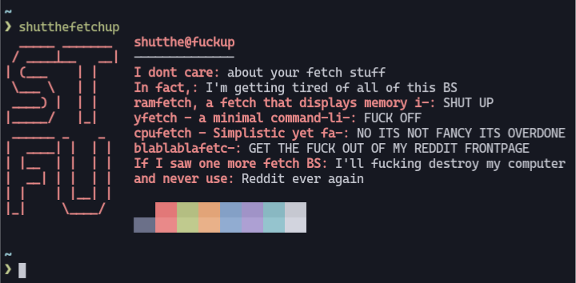

# shutthefetchup
A minimal fetch tool to tell all users who posts those annoying fetch BS on r/linux to shut the fuck up.



> NOTE: This is just a joke and isn't meant to be taken seriously.

## Installation
```shell
$ git clone https://github.com/leap0x7b/shutthefetchup
$ cd shutthefetchup
# install -m755 shutthefetchup /usr/local/bin
$ shutthefetchup
```

## License
shutthefetchup is licensed under the [WTFPL](https://wtfpl.net) license. This means that you can do what ever the fuck you want with this project. See the [LICENSE](LICENSE) file for more information.
